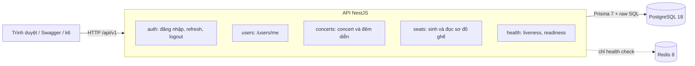
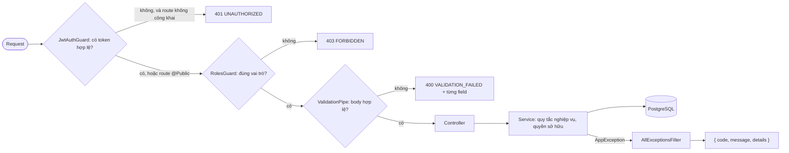
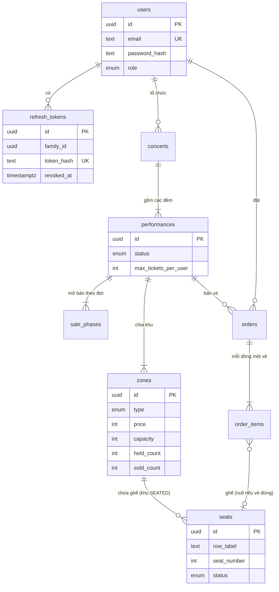
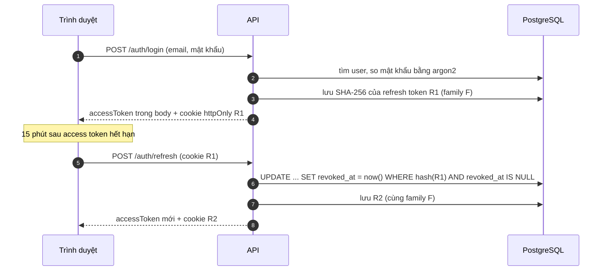
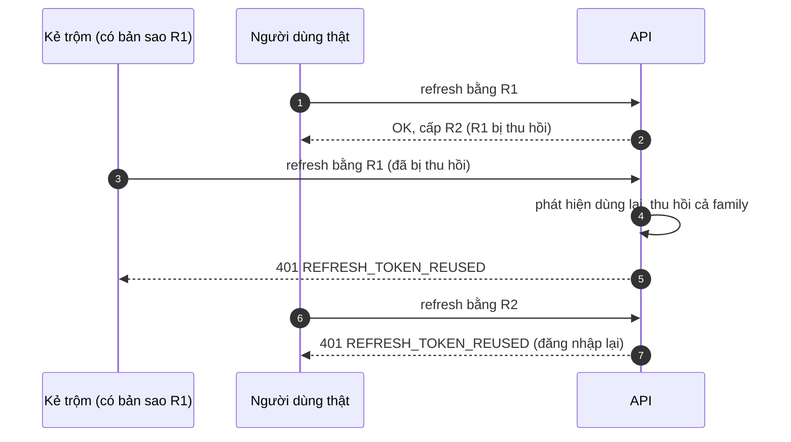
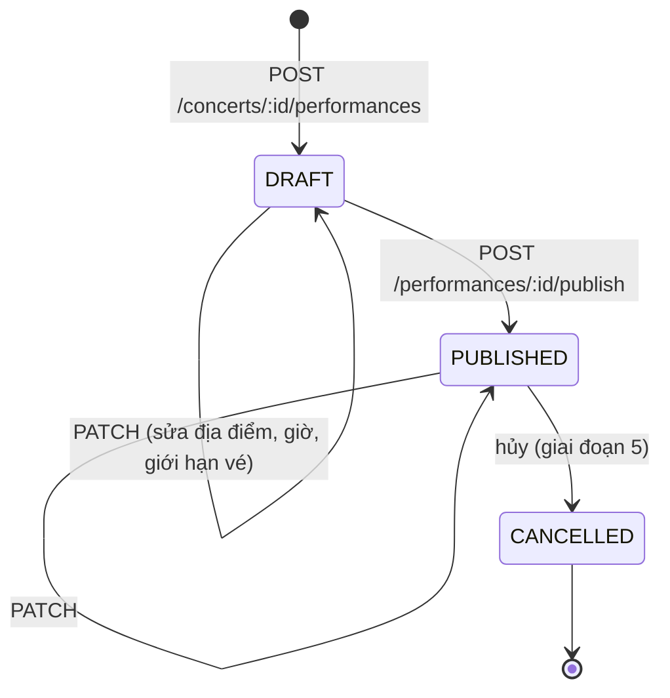
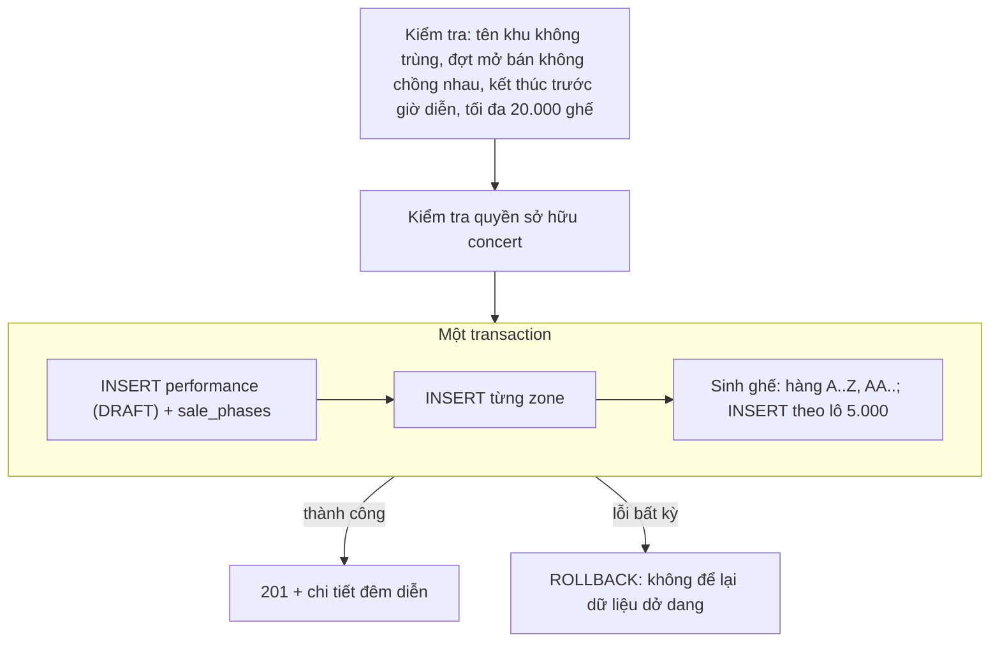

# Giai đoạn 1: Dữ liệu, xác thực, danh mục

**Demo:** chạy `pnpm showcase` rồi mở <http://localhost:4100/phase-01/> · **Video:** [phase-01.mp4](video/phase-01.mp4) · **Ghi chú học tập:** [phase-01-data-and-auth.md](../../learning/phase-01-data-and-auth.md)

Giai đoạn này dựng phần nền cho mọi thứ phía sau:
- Database chứa concert, đêm diễn, khu và ghế.
- Đăng nhập an toàn với refresh token xoay vòng.
- Phân quyền theo 3 vai trò.
- API để ban tổ chức tạo đêm diễn và khách xem sơ đồ ghế.

Chưa có chức năng đặt vé. Đặt vé bắt đầu từ giai đoạn 2.

## Sơ đồ

### Kiến trúc hiện tại

Một tiến trình NestJS chạy trong Docker, nói chuyện với PostgreSQL. Redis đã kết nối nhưng đến giai đoạn 4 mới dùng.

### Đường đi của một request

Mọi request đi qua cùng một dây chuyền. Lỗi ở bất kỳ bước nào cũng được trả về cùng một dạng `{ code, message, details }`.

### Mô hình dữ liệu

9 bảng. `orders` và `order_items` đã có, nhưng đến giai đoạn 2 mới được dùng.

### Đăng nhập và xoay vòng refresh token

Access token sống 15 phút và nằm trong bộ nhớ của trang. Refresh token sống 7 ngày, nằm trong cookie `httpOnly` nên JavaScript không đọc được. Mỗi lần dùng, refresh token cũ bị thu hồi và một token mới được cấp.

### Phát hiện refresh token bị đánh cắp

Nếu một token đã bị thu hồi lại được gửi lên, nghĩa là có hai người cùng giữ nó. Hệ thống thu hồi cả family, và cả hai đều phải đăng nhập lại.

### Vòng đời một đêm diễn

Bản nháp chỉ chủ concert xem được. Công bố bằng một câu `UPDATE ... WHERE status = 'DRAFT'`: hai lần bấm cùng lúc thì chỉ một lần thành công.

### Tạo đêm diễn trong một transaction

Đêm diễn, đợt mở bán, khu và hàng nghìn ghế được tạo cùng nhau: hoặc tất cả thành công, hoặc không có gì được ghi.

## Con số

| Chỉ số | Giá trị |
| --- | --- |
| Unit test / e2e test | 12 / 29, đều qua |
| Seed (5.002 tài khoản, 16.100 ghế) | khoảng 4,5 giây |
| `GET /performances/:id/seats` với 8.000 ghế | 1,1 MB, 65–100 ms (tối ưu ở giai đoạn 7a) |
